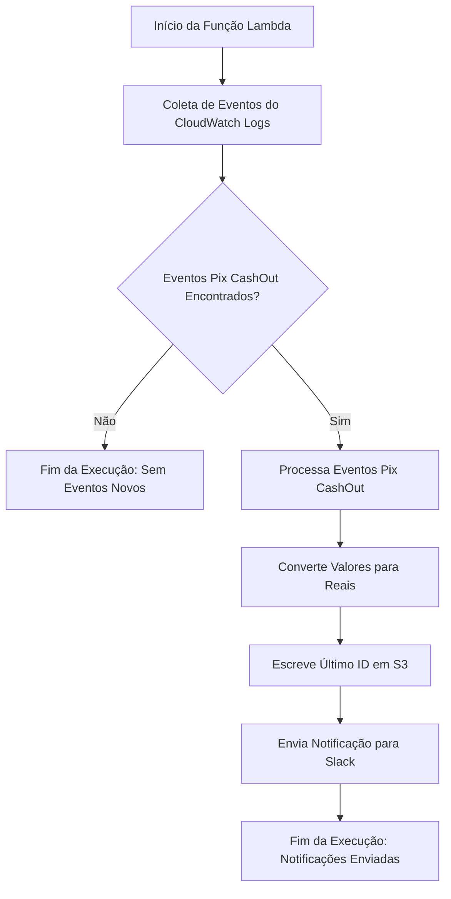

# pxStream

<p align="center">

</p>

## Visão Geral do Projeto

O **pxStream** é uma ferramenta de monitoramento de eventos `Pix`, otimizada para ambientes **AWS serverless**, utilizando AWS Lambda para processamento event-driven, CloudWatch Logs para coleta de dados e S3 para gerenciamento de estado, oferece uma solução concisa e robusta para o rastreamento eficiente de transações Pix.

Projetado para ser direto e funcional, o pxStream atende às necessidades de monitoramento em tempo real, com escalabilidade para lidar com cargas de trabalho variáveis.

## Funcionalidades do Projeto pxStream
O projeto pxStream possui as seguintes funcionalidades principais:

1. **Envio de Mensagens para o Slack:** A função `enviar_mensagem_slack` gera mensagens formatadas e as envia para um canal específico no Slack. Essas mensagens contêm informações sobre os eventos Pix identificados.
2. **Armazenamento e Leitura de Último ID de Evento:** As funções `write_int_to_s3_file` e `read_last_id_from_s3` lidam com a escrita e leitura do último ID de evento processado em um objeto S3, isso permite controlar eventos já processados e evitar duplicações.
3. **Conversão de Valores Monetários:** A função `centavos_para_reais` converte valores em centavos para o formato de reais, facilitando a exibição dos montantes de eventos.
4. **Obtenção de Eventos AWS:** A função `get_aws_events` obtém eventos de um log group específico dentro de um intervalo de tempo determinado.
5. **Processamento de Eventos:** A função `process_event` processa informações específicas de cada evento, extrai dados relevantes e os organiza para posterior análise.

## Requisitos e Segurança

O projeto pxStream foi cuidadosamente desenvolvido para garantir máxima segurança e eficiência, utilizando um conjunto mínimo de dependências externas.

Ele depende exclusivamente das seguintes configurações e tecnologias, todas fornecidas pela própria AWS, garantindo uma proteção robusta contra ameaças comuns de segurança, como ataques de cadeia de suprimentos e envenenamento de pacotes:

- **AWS Lambda:** A espinha dorsal do pxStream, o AWS Lambda permite a execução do código Python em um ambiente serverless. Esta escolha não só garante eficiência e escalabilidade, mas também isola o código de possíveis vulnerabilidades associadas a servidores tradicionais e suas dependências.

- **AWS S3:** Utilizado de forma estratégica para armazenar o último ID de evento processado, o Amazon S3 oferece um armazenamento seguro e confiável, crucial para manter a integridade dos dados do pxStream e garantir um processamento contínuo e sem duplicidades.

- **AWS CloudWatch Logs:** Essencial para a obtenção de eventos específicos a partir de log groups, o CloudWatch Logs fornece uma fonte confiável e segura de dados de log, permitindo um monitoramento detalhado e em tempo real das transações Pix.

- **Boto3:** A única biblioteca externa utilizada é o Boto3, o AWS SDK oficial para Python. A grande vantagem é que ela já vem pré-instalada no ambiente AWS Lambda, eliminando a necessidade de gerenciar ou atualizar esta dependência.

Ao minimizar as dependências externas e aproveitar as soluções integradas e seguras da AWS, o pxStream se posiciona como uma ferramenta extremamente segura e confiável para monitoramento de transações Pix, ideal para ambientes onde a segurança dos dados e a confiabilidade do sistema são de suma importância.

## Uso

O projeto pxStream é executado como uma função AWS Lambda e pode ser configurado para ser acionado via eventos e agendamentos.

A integração com o Slack requer a configuração de um Webhook URL específico na variavel de ambiente `SLACK_WEBHOOK`, além disso, é necessário configurar as permissões adequadas para acesso aos serviços da AWS, como Amazon `S3` e AWS `CloudWatch Logs`.

Abaixo o `json` da policy que a funcao lambda precisa para funcionar corretamente.

```json
{
    "Version": "2012-10-17",
    "Statement": [
        {
            "Effect": "Allow",
            "Action": [
                "logs:DescribeLogStreams",
                "logs:GetLogEvents",
                "logs:FilterLogEvents"
            ],
            "Resource": "arn:aws:logs:REGION:ACCOUNT_ID:log-group:LOG_GROUP_NAME:*"
        },
        {
            "Effect": "Allow",
            "Action": [
                "s3:GetObject",
                "s3:PutObject"
            ],
            "Resource": "arn:aws:s3:::bucket-name-here/lastId.txt"
        }
    ]
}
```

## Estrutura do Projeto pxStream

O projeto pxStream é estruturado de forma eficiente e coesa, consistindo em um único arquivo Python, `px_stream.py`, este arquivo centraliza todas as operações necessárias para o monitoramento eficaz de eventos Pix, abrangendo desde a coleta de dados até a notificação. A estrutura e funcionalidade do arquivo são detalhadas no seguinte fluxograma.



### Descrição do Fluxograma:

- **Início da Função Lambda:** A execução da função Lambda é iniciada, podendo ser acionada automaticamente ou manualmente.
- **Coleta de Eventos do CloudWatch Logs:** A função recupera os eventos Pix CashOut do CloudWatch Logs.
- **Eventos Pix CashOut Encontrados?:** Verifica se há novos eventos Pix CashOut para processar.
- **Fim da Execução: Sem Eventos Novos:** Se não houver novos eventos, a função termina sua execução.
- **Processa Eventos Pix CashOut:** Os eventos Pix CashOut encontrados são processados, extraindo e analisando as informações relevantes.
- **Converte Valores para Reais:** Os valores monetários dos eventos são convertidos de centavos para reais.
- **Escreve Último ID em S3:** O ID do último evento processado é armazenado em um objeto S3 para manter o controle dos eventos e evitar processamentos duplicados.
- **Envia Notificação para Slack:** Uma notificação é enviada para um canal do Slack, informando sobre os eventos processados.
- **Fim da Execução: Notificações Enviadas:** Após enviar as notificações, a função termina sua execução.

---
